# BasicoGit

Este documento apresenta os passos básicos para iniciar um projeto com Git e enviar as alterações para o GitHub.

## Criar pasta
Primeiro, crie uma pasta para o projeto.


## Acessar a pasta
Entre na pasta criada.

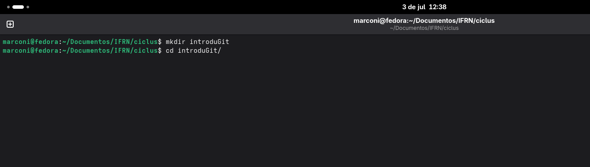

## Iniciar o Git
No terminal, inicialize o Git dentro da pasta.


Depois disso, o Git estará pronto para acompanhar as alterações do projeto.

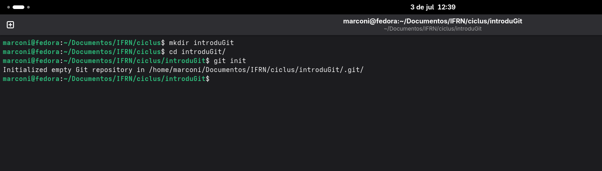

## Criar repositório no GitHub
Acesse o GitHub e crie um novo repositório para o projeto.

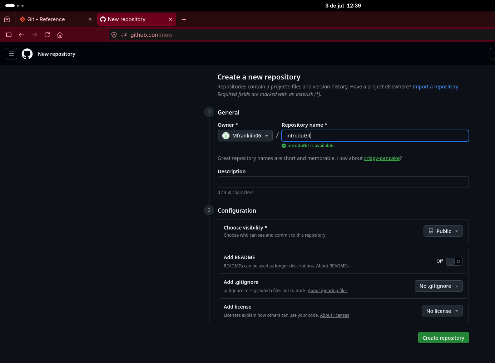

Essa é a tela inicial quando cria-se um repositório

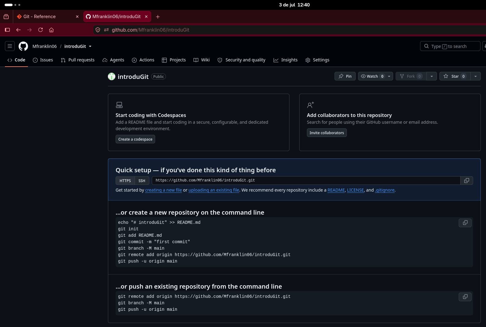

## Conectar o repositório local ao remoto
No terminal, adicione o repositório remoto ao projeto local utilizando o seguinte comando:

```bash
git remote add origin <link-do-repositorio>
```

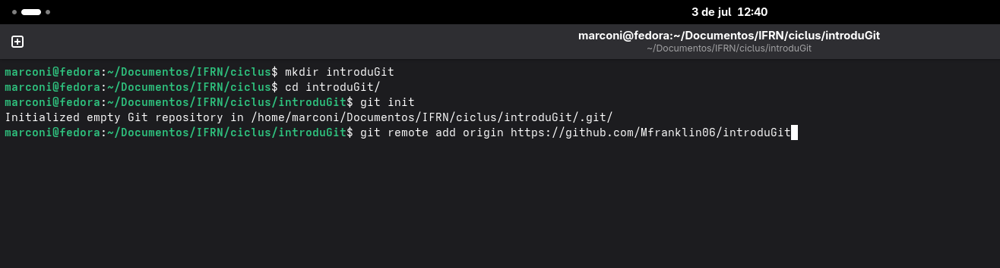

## Criar o README
Crie o arquivo README.md com as informações do projeto.


## Adicionar alteração

Adicione essa alteração com o comando
```bash
git add <nome-do-arquivo>
```
também pode ser feito utilizando o (por isso as duas barras "||" na imagem): 
```bash
git add .
```
esse comando adiciona todos os arquivos, sendo ideal para se utilizar quando eles mudam as mesmas coisas.


## Fazer commit
Crie um commit para salvar as alterações no histórico do Git com o comando:

```bash
git commit -m "Adiciona README"
```

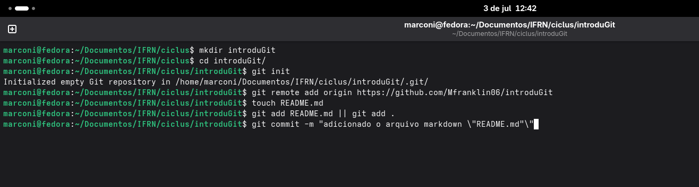

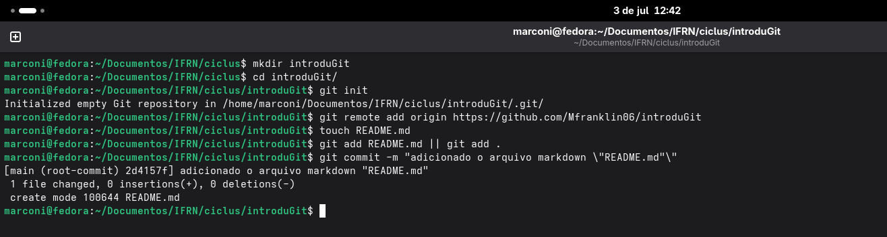

## Trabalhar com branches
Após commitar, envia-se as alterações para o repositório remoto, mas antes deve-se verificar a branch atual, fazendo:

```bash
git branch
```


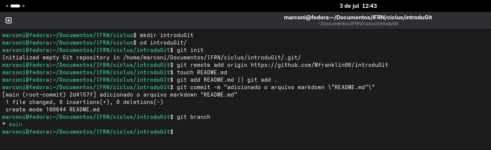

Se quiser criar uma nova branch:

```bash
git checkout -b nome-da-branch
```

## Enviar para o GitHub
Assim, quando verificado se está na branch certa, as alterações podem ser enviadas para o repositório remoto com o seguinte comando:

```bash
git push origin main
```


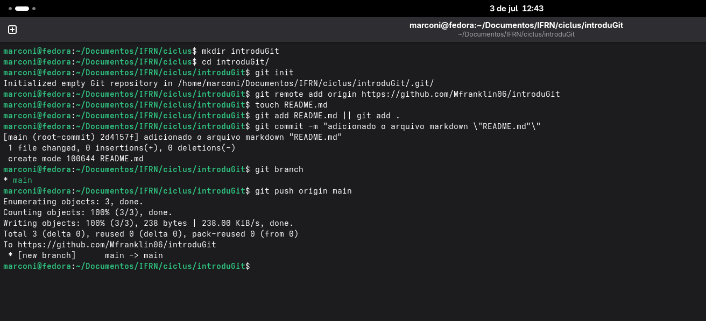

Assim fica a tela do github com as mudanças feitas:

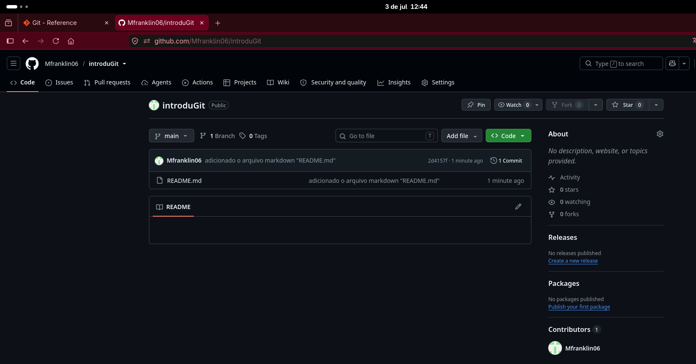

## Fazer alterações e enviar novamente
Depois de editar arquivos, adicione, faça commit e envie as mudanças.


Abrir a pasta do projeto e editar o arquivo README.md:


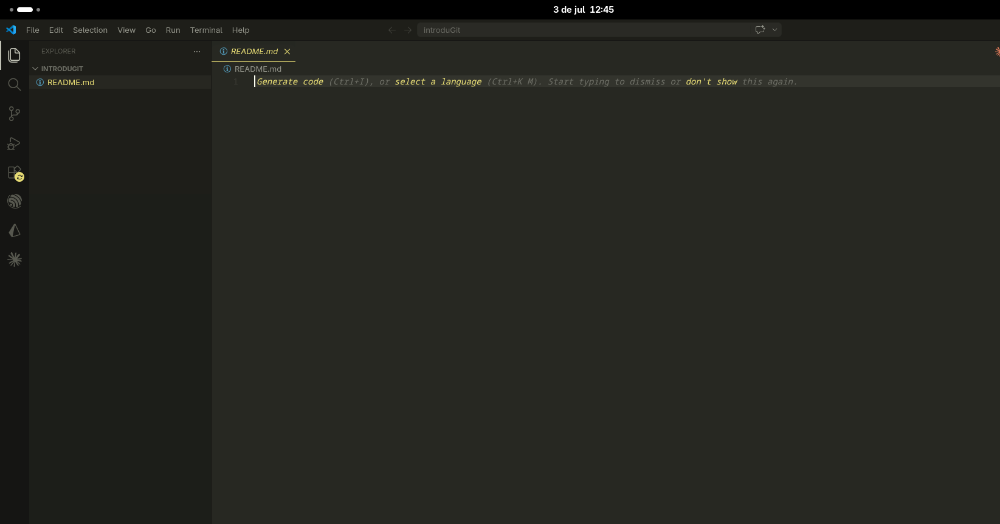

No code, modificamos o arquivo README.md:


Então, adicionamos a modificação:

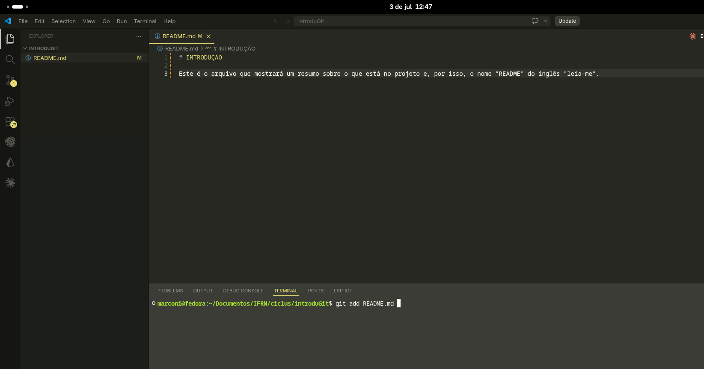

Depois, fazemos o commit da modificação:


Com isso, enviamos a modificação para o repositório remoto:
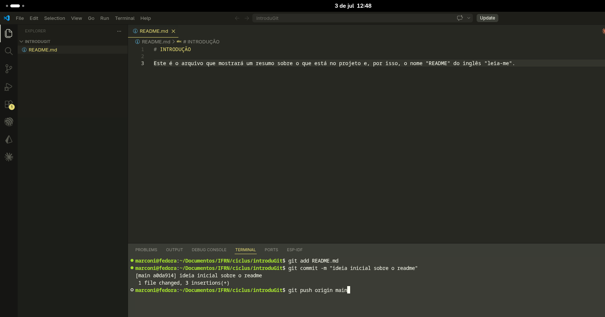

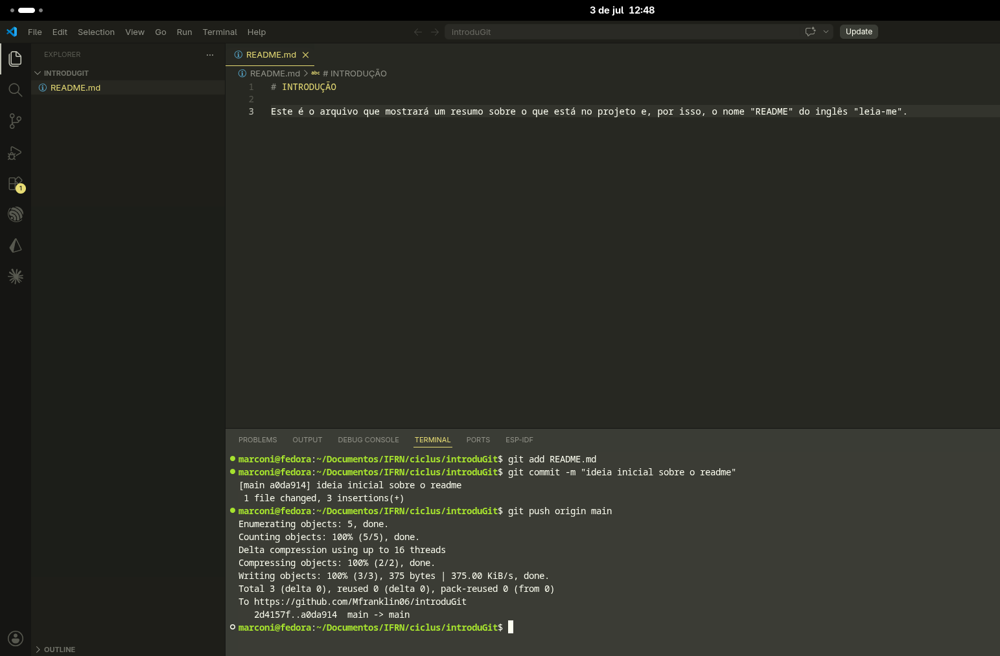

Assim fica a tela do GitHub com a modificação feita:


Esses passos formam o fluxo básico do Git: criar projeto, iniciar o Git, adicionar arquivos, fazer commit e enviar para o GitHub.